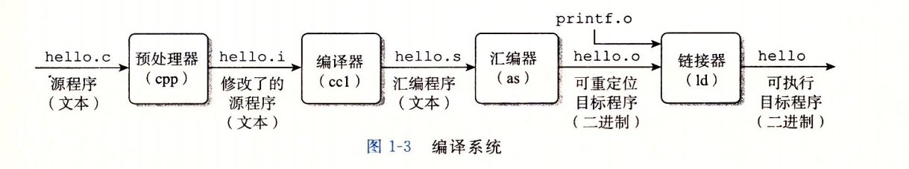
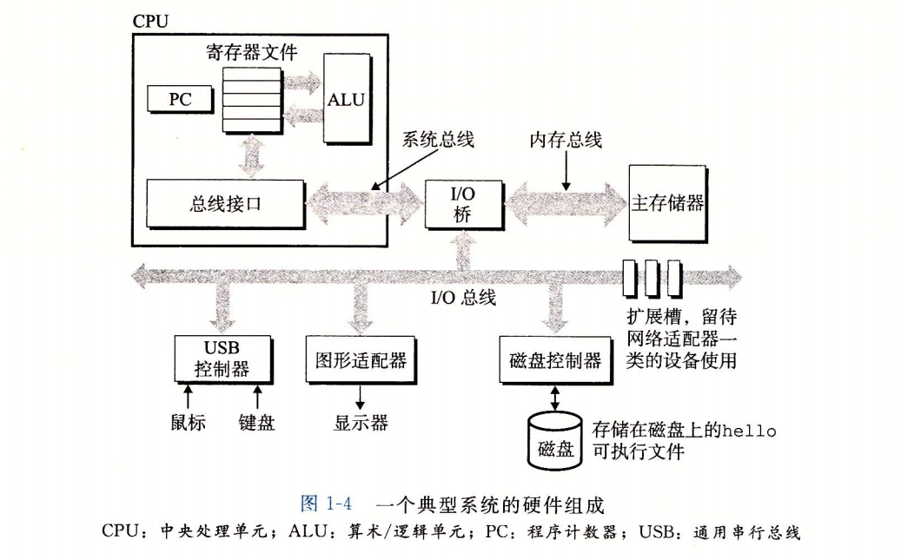

# 计算机系统漫游
计算机系统是由硬件和软件组成的，他们共同工作来运行应用程序

## 信息就是位 + 上下文
源程序实际上就是一个由值0和1组成的**位**（又称为比特）序列，8个被组织成一组称为**字节**。每个字节表示程序中的某些文本字符。

基本思想：系统中所有的信息---包括磁盘文件、内存中的程序、内存中存放的用户数据以及网络上传送的数据，都是由一串比特表示的。区分不同数据对象的唯一方法是我们读到这些数据对象时的上下文。

## 程序如何被编译的

在Unix系统上，从源文件到目标文件的转化时由编译器驱动程序完成的：

## 处理器读并解释存储在内存中的指令

#### 系统的硬件组成

> 1. 总线

贯穿整个系统的时一组电子管道，称作总线。它携带信息字节并负责在各个部件间传递。通常总线被设计成传送定长的字节块即**字（word）** 字中的字节数（字长）时基本系统参数，且各个系统不尽相同。如现在大多数机器要么时4字节（32位）或8字节（64位）

> 2. I/O 设备

I/O(输入输出)设备时系统与外部世界的联系通道。 每个I/O设别都通过一个控制器或适配器与I/O总线相连。控制器和适配器之间的区别主要在于他们的封装方式。控制器是I/O设备本身或者系统的主印制电路板(通常称作主板)上的芯片组.而适配器则是一块插在主板插槽上的卡。它们的功能都是在I/O总线和I/O设备之间传递信息

> 3. 主存

主存是一个临时存储设备,在处理器执行程序时,用来存放程序和程序处理的数据。从物理上来说, 主存是一组由**动态随机存储器(DRAM)**芯片组成的。从逻辑上来说, 存储器是一个线性的字节数组, 每个字节都有其唯一的地址(数组索引),这些地址是从零开始的。

> 4. 处理器

**中央处理单元(CPU)**, 简称处理器, 是解释(或执行)存储在主存中指令的引擎。处理器的核心是一个大小为一个字的存储设备(或**寄存器**), 称为**程序计数器(PC)**。在任何时刻, PC都指向主存中的某条机器语言指令(指含有该条指令的地址)。

处理器看上去是它的指令集架构的简单实现, 但是实际上现代处理器使用了非常复杂的机制来加速程序的执行。因此, 我们将处理器的指令集架构和处理器的微体系结构区分开来: **指令集架构**描述的是每条机器代码指令的效果; 而**微体系结构**描述的是处理器实际上是如何实现的

